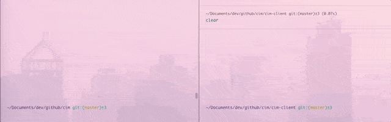
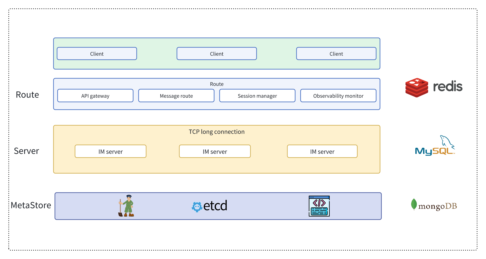
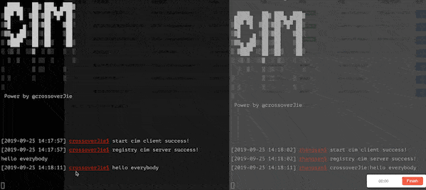

<div align="center">


<br/>

[](https://codecov.io/gh/crossoverJie/cim)
[](https://github.com/crossoverJie/cim)
[](https://juejin.im/post/5c2bffdc51882509181395d7)

📘[介绍](#介绍) |📽[视频演示](#视频演示) | 🏖[TODO LIST](#todo-list) | 🌈[系统架构](#系统架构) |💡[流程图](#流程图)|🌁[快速启动](#快速启动)|👨🏻‍✈️[内置命令](#客户端内置命令)|🎤[通信](#群聊私聊)|❓[QA](https://github.com/crossoverJie/cim/blob/master/doc/QA.md)|💌[联系作者](#联系作者)

[English](README.md)

</div>
<br/>

# V2.0
- [x] 升级至 JDK17 & springboot3.0
- [x] Client SDK
- [ ] 客户端使用 [picocli](https://picocli.info/) 替代 springboot
- [x] 支持集成测试
- [x] 集成 OpenTelemetry
- [ ] 支持单节点启动（不依赖外部组件）
- [ ] 第三方组件支持替换（Redis/Zookeeper 等）
- [ ] 支持 Web 客户端（websocket）
- [x] 支持 Docker 容器
- [ ] 支持 Kubernetes 部署
- [ ] 支持二进制客户端（使用 golang 构建）

## 介绍

`CIM(CROSS-IM)` 是面向开发者的 `IM（即时通讯）` 系统；同时提供了一些组件帮助开发者构建自己可扩展的 `IM`。
借助 `CIM` 你可以实现以下需求：
- `IM` 即时通讯系统。
- `APP` 消息推送中间件。
- `IOT` 海量连接场景中的消息中间件。

> 如果在使用或开发过程中有任何问题，可以[联系作者](#联系作者)。

## 视频演示

> 点击下方链接可以查看视频版 Demo。

| YouTube | Bilibili|
| :------:| :------: |
| [群聊](https://youtu.be/_9a4lIkQ5_o) [私聊](https://youtu.be/kfEfQFPLBTQ) | [群聊](https://www.bilibili.com/video/av39405501) [私聊](https://www.bilibili.com/video/av39405821) |
|   | 



## TODO LIST

* [x] [群聊](#群聊)
* [x] [私聊](#私聊)
* [x] [内置命令](#客户端内置命令)
* [x] [聊天记录查询](#聊天记录查询)
* [x] [一键开启 AI 模式](#ai-模式)
* [x] 使用 `Google Protocol Buffer` 高效编解码
* [x] 根据实际情况灵活的水平扩容、缩容
* [x] 服务端自动剔除离线客户端
* [x] 客户端自动重连
* [x] [延时消息](#延时消息)
* [x] SDK 开发包
* [ ] 分组群聊
* [ ] 离线消息
* [ ] 消息加密


## 系统架构



- `CIM` 中的各个组件均采用 `SpringBoot` 构建
  - 客户端基于 [cim-client-sdk](https://github.com/crossoverJie/cim/tree/master/cim-client-sdk) 构建
- 采用 `Netty` 构建底层通信
- `MetaStore` 用于 `IM-server` 服务的注册与发现


### cim-server
IM 服务端，用于接收客户端连接、消息转发、消息推送等功能。
支持集群部署。

### cim-route

路由服务器；用于处理消息路由、消息转发、用户登录、用户下线以及一些运维工具（获取在线用户数等）。

### cim-client
IM 客户端终端，一个命令即可启动并与其他人进行通信（群聊、私聊）。

## 流程图


- Server 注册到 `MetaStore`
- Route 订阅 `MetaStore`
- Client 登录到 Route
  - Route 从 `MetaStore` 获取 Server 信息
- Client 与 Server 建立连接
- Client1 发送消息到 Route
- Route 选择 Server 并将消息转发给 Server
- Server 将消息推送给 Client2


## 快速启动

### Docker

`allin1` 镜像内置了 Zookeeper、Redis、cim-server、cim-forward-route 四个服务，使用 [Supervisor](http://supervisord.org/) 统一管理，开箱即用。

**支持平台：** linux/amd64, linux/arm64, linux/arm/v7

**端口说明：**

| 端口 | 服务 | 说明 |
|------|---------|-------------|
| 2181 | Zookeeper | 服务注册与发现 |
| 6379 | Redis | 数据缓存 |
| 8083 | Route Server | HTTP API 路由服务 |

拉取镜像并启动：

```shell
docker pull ghcr.io/crossoverjie/allin1-ubuntu:latest
docker run -p 2181:2181 -p 6379:6379 -p 8083:8083 --rm --name cim-allin1 ghcr.io/crossoverjie/allin1-ubuntu:latest
```

容器启动后，可参考下方 [注册账号](#注册账号) 和 [启动客户端](#启动客户端) 章节快速体验完整的 IM 流程。

### 本地构建 Docker 镜像

如果需要从源码构建镜像：

```shell
# 在项目根目录执行
docker build -t cim-allin1:latest -f docker/allin1-ubuntu.Dockerfile .
docker run -p 2181:2181 -p 6379:6379 -p 8083:8083 --rm --name cim-allin1 cim-allin1:latest
```

### 本地编译

首先需要安装 `Zookeeper`、`Redis` 并保证网络通畅。

```shell
docker run --rm --name zookeeper -d -p 2181:2181 zookeeper:3.9.2
docker run --rm --name redis -d -p 6379:6379 redis:7.4.0
```

```shell
git clone https://github.com/crossoverJie/cim.git
cd cim
mvn clean install -DskipTests=true
cd cim-server && cim-client && cim-forward-route
mvn clean package spring-boot:repackage -DskipTests=true
```

### 部署 IM-server（cim-server）

```shell
cp /cim/cim-server/target/cim-server-1.0.0-SNAPSHOT.jar /xx/work/server0/
cd /xx/work/server0/
nohup java -jar  /root/work/server0/cim-server-1.0.0-SNAPSHOT.jar --cim.server.port=9000 --app.zk.addr=zk地址  > /root/work/server0/log.file 2>&1 &
```

> cim-server 集群部署同理，只要保证 Zookeeper 地址相同即可。

### 部署路由服务器（cim-forward-route）

```shell
cp /cim/cim-server/cim-forward-route/target/cim-forward-route-1.0.0-SNAPSHOT.jar /xx/work/route0/
cd /xx/work/route0/
nohup java -jar  /root/work/route0/cim-forward-route-1.0.0-SNAPSHOT.jar --app.zk.addr=zk地址 --spring.redis.host=redis地址 --spring.redis.port=6379  > /root/work/route/log.file 2>&1 &
```

> cim-forward-route 本身就是无状态，可以部署多台；使用 Nginx 代理即可。


### 启动客户端

```shell
cp /cim/cim-client/target/cim-client-1.0.0-SNAPSHOT.jar /xx/work/route0/
cd /xx/work/route0/
java -jar cim-client-1.0.0-SNAPSHOT.jar --server.port=8084 --cim.user.id=唯一客户端ID --cim.user.userName=用户名 --cim.route.url=http://路由服务器:8083/
```


如上图，启动两个客户端可以互相通信即可。

### 本地启动客户端

#### 注册账号
```shell
curl -X POST --header 'Content-Type: application/json' --header 'Accept: application/json' -d '{
  "reqNo": "1234567890",
  "timeStamp": 0,
  "userName": "zhangsan"
}' 'http://路由服务器:8083/registerAccount'
```

从返回结果中获取 `userId`

```json
{
    "code":"9000",
    "message":"成功",
    "reqNo":null,
    "dataBody":{
        "userId":1547028929407,
        "userName":"test"
    }
}
```

#### 启动本地客户端
```shell
# 启动本地客户端
cp /cim/cim-client/target/cim-client-1.0.0-SNAPSHOT.jar /xx/work/route0/
cd /xx/work/route0/
java -jar cim-client-1.0.0-SNAPSHOT.jar --server.port=8084 --cim.user.id=上方返回的userId --cim.user.userName=用户名 --cim.route.url=http://路由服务器:8083/
```

## 客户端内置命令

| 命令 | 描述|
| ------ | ------ |
| `:q!` | 退出客户端|
| `:olu` | 获取所有在线用户信息 |
| `:all` | 获取所有命令 |
| `:q [option]` | 【:q 关键字】查询聊天记录 |
| `:ai` | 开启 AI 模式 |
| `:qai` | 关闭 AI 模式 |
| `:pu` | 模糊匹配用户 |
| `:info` | 获取客户端信息 |
| `:emoji [option]` | 查询表情包 [option:页码] |
| `:delay [msg] [delayTime]` | 发送延时消息 |
| `:` | 更多命令正在开发中。。 |


### 聊天记录查询


使用命令 `:q 关键字` 即可查询与个人相关的聊天记录。

> 客户端聊天记录默认存放在 `/opt/logs/cim/`，所以需要这个目录的写入权限。也可在启动命令中加入 `--cim.msg.logger.path = /自定义` 参数自定义目录。


### AI 模式


使用命令 `:ai` 开启 AI 模式，之后所有的消息都会由 `AI` 响应。

`:qai` 退出 AI 模式。

### 前缀匹配用户名


使用命令 `:qu prefix` 可以按照前缀的方式搜索用户信息。

> 该功能主要用于在移动端中的输入框中搜索用户。

### 群聊/私聊

#### 群聊


群聊只需要在控制台里输入消息回车后即可发送，同时所有在线客户端都可收到消息。

#### 私聊

私聊首先需要知道对方的 `userID` 才能进行。

输入命令 `:olu` 可列出所有在线用户。


接着使用 `userId;;消息内容` 的格式即可发送私聊消息。


同时另一个账号收不到消息。


### emoji 表情支持

使用命令 `:emoji 1` 查询出所有表情列表，使用表情别名即可发送表情。


### 延时消息

发送 10s 的延时消息：

```shell
:delay delayMsg 10
```



## 联系作者

## 贡献指南

欢迎贡献代码！提交 PR 前，请确保代码通过 Checkstyle 检查。

### 代码风格

本项目使用 [Checkstyle](https://checkstyle.org/) 来规范代码风格，规则定义在 `checkstyle/checkstyle.xml` 中。

**提交前在本地运行 Checkstyle：**

```shell
mvn checkstyle:check
```

**主要规则：**
- `{`、`}` 和运算符前后使用空格
- 行尾不能有空格
- 文件必须以换行符结尾
- 删除未使用的 import
- 常量（`static final`）必须使用 `UPPER_SNAKE_CASE` 命名
- 使用 Java 风格的数组声明：`String[] args`（而非 `String args[]`）

**快速构建时跳过 Checkstyle：**

```shell
mvn package -Dcheckstyle.skip=true
```

<div align="center">

<a href="https://t.zsxq.com/odQDJ" target="_blank"></a>
</div>

最近开通了知识星球，感谢大家对 CIM 的支持，为大家提供 100 份 10 元优惠券，也就是 69-10=59 元，具体福利大家可以扫码参考再决定是否加入。

> PS: 后续会在星球开始 V2.0 版本的重构，感兴趣的可以加入星球当面催更（当然代码依然会开源）。

- [crossoverJie@gmail.com](mailto:crossoverJie@gmail.com)
- 微信公众号


